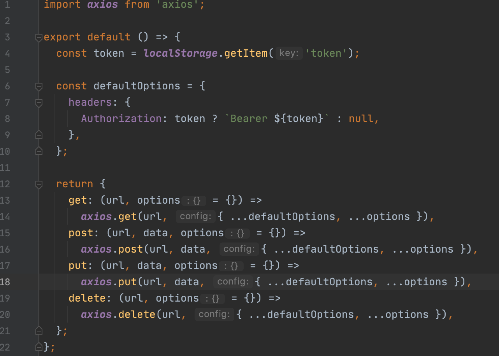
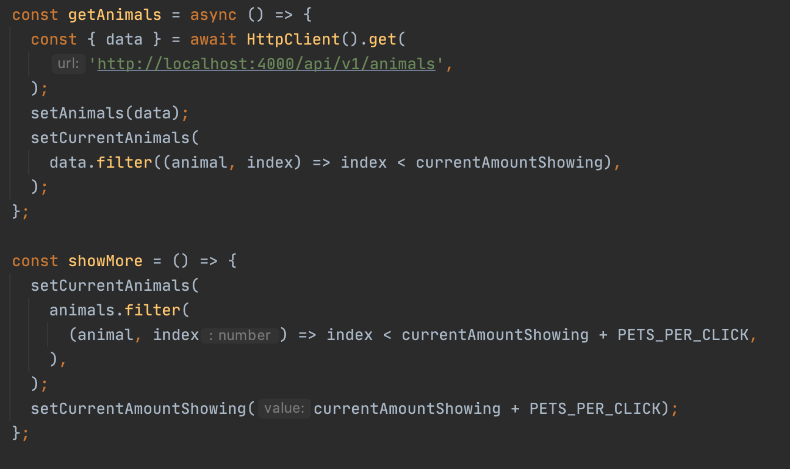
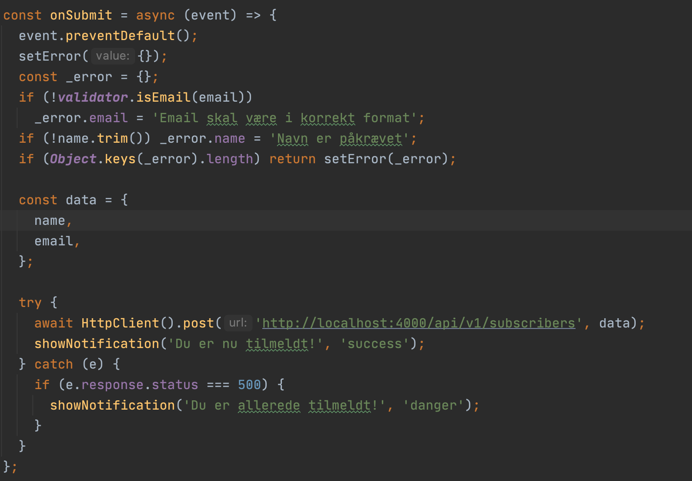
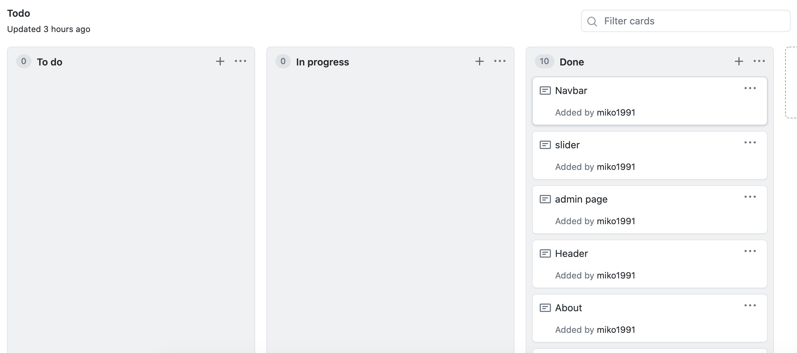
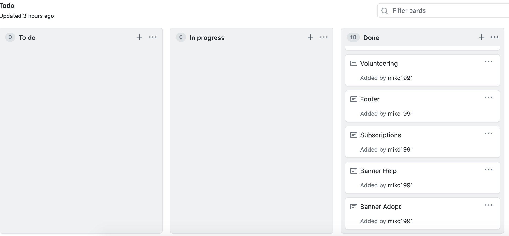

# Svendeprøve - Foreningen for Dyrevelfærd

- Mikolaj Marciniak
- WUHF02
- URL til site: http://localhost:3000
- URL til login: http://localhost:3000/auth/login
- Brugernavn: admin, kodeord: 1234

## Applikation teknologi stack

- react
- react-router-dom
- react-notifications-component
- react-image-slideshow
- tailwindcss

## Guide

- cd client
- npm install
- npm start

## Min indsats

Jeg synes det har været et spændende forløb, dog vil jeg ikke mene,
at der har været noget, som jeg ikke har prøvet før. Jeg vurderer
min indsats til at være tilfredsstillende på mange område, både
fordi jeg løste problemerne hurtigt og effektivt, og med kvalitet.
Jeg synes, at terminsprøven var mere udfordrende og denne opgave var rimelig
simpel. Dog synes jeg, at der burde være noget ekstra information ang.
administrationsdelen. Nu har jeg haft meget erfaring med at lave
sådanne løsninger så det var lige til.

## Mine valg

Jeg har valgt at anvende react til opgaven, fordi de fleste jobs kræver,
at man er god til det og har flere års erfaring med det. Jeg har
anvendt også react-router-dom til route behandling, og nogle andre
tredje-parts biblioteker, såsom slider. Jeg har brugt denne slider,
fordi det er et rigtig godt bibliotek og nemt at bruge, og man skal ikke
genopfinde hjul på ny, hvis man kan undgå det.

Jeg har desuden brugt et bibliotek til notifikationer, som både er lækkert
og nemt at bruge. Det har jeg gjort fordi det er en meget god løsning
at vise en notifikation, som ikke forstyrrer layoutet.

## Kodeeksempler

1. HttpClient
   

2. Animals - vis flere knappen (funktionalitet)
   

3. Tilmelding til nyhedsbrev
   

## Bilag - kanban board

